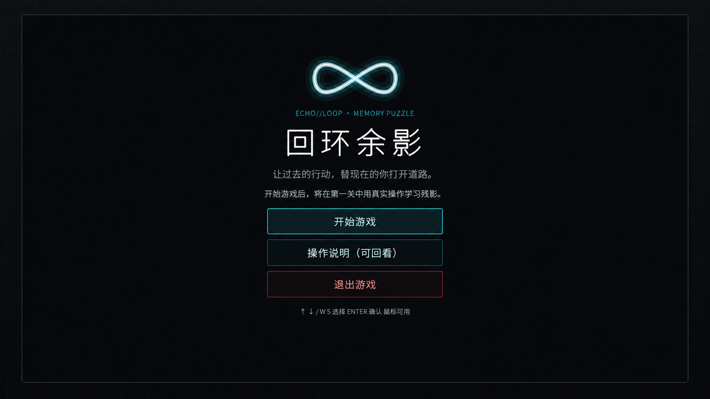
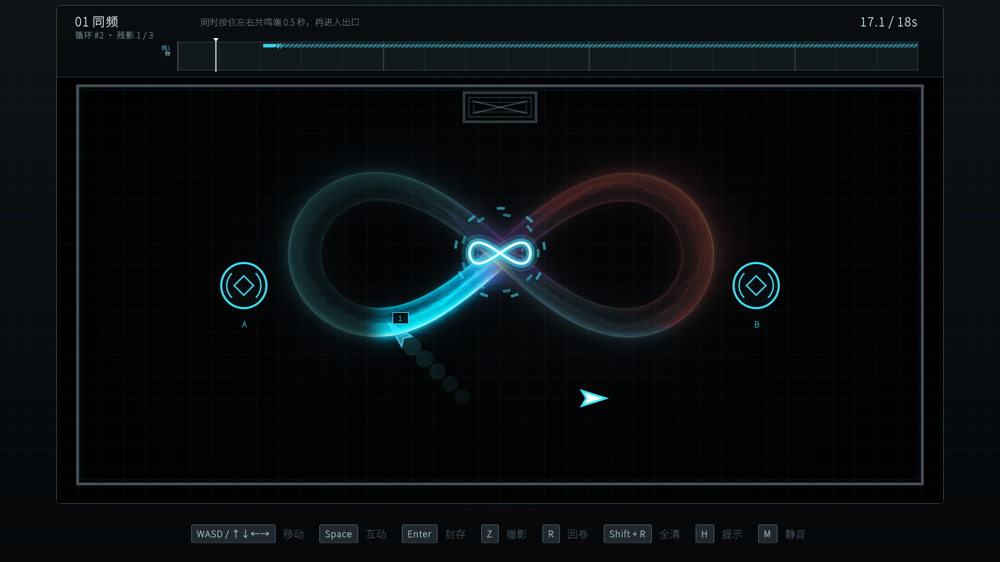
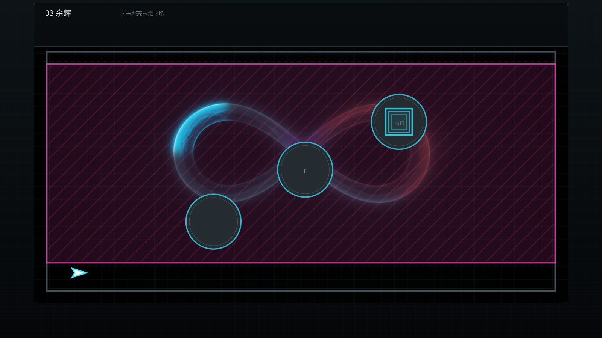
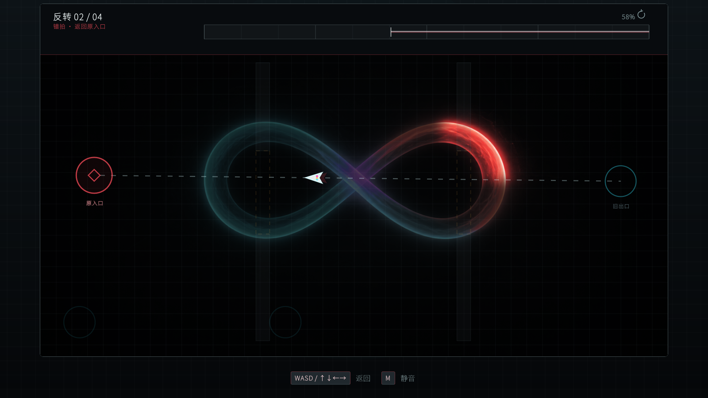
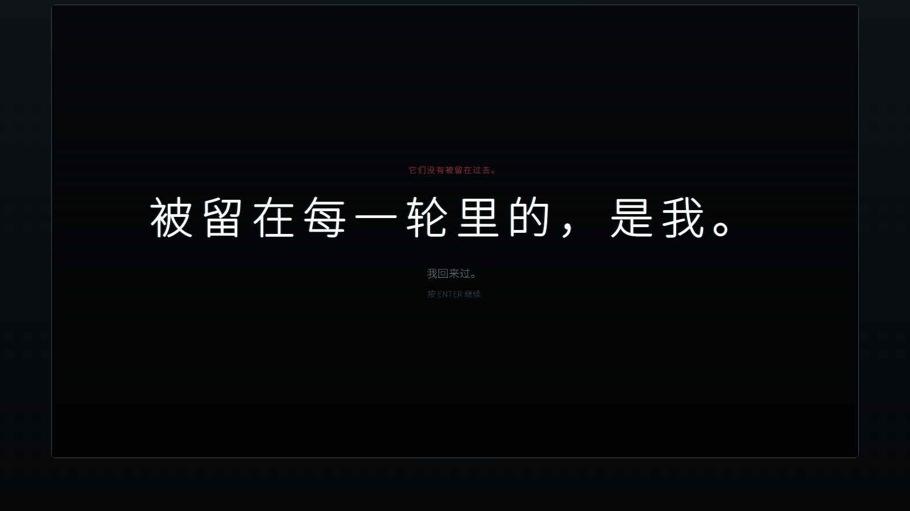

# 回环余影

### ECHO // LOOP · MEMORY PUZZLE

**让过去的行动，替现在的你打开道路。**

过去并未消失。它只是沿着你走过的轨迹，等待下一次重演。

---

## 一场与「过去的自己」合作的记忆谜题

《回环余影》是一款以时间循环与行动残影为核心的短篇解谜游戏。

你走过的路线、停留的时机、触发过的机关，都会在下一轮成为可见的“残影”。它们精确重演过去，而此刻的你必须与这些旧日行动配合：让另一个自己守住开关、错开门扉、留下余辉，最终走出一条只有跨越多次循环才能完成的路。

游戏以四个章节层层递进，从认识残影，到与残影协作，再到重新理解“循环”本身。它既是一组空间与时序谜题，也是一段关于记忆、自我与回返的微型叙事。

> **它们没有被留在过去。**  
> 被留在每一轮里的，是我。

## 游戏体验

| | |
|:--|:--|
| **行动成为解法** | 每一轮都会留下可重演的路线，用过去的行为解决现在无法独自完成的机关。 |
| **四幕递进谜题** | 同频、错拍、余辉、整合——每一关都为同一套规则加入新的意义。 |
| **克制的视听语言** | 冷色界面、负片光轨、呼吸般的反馈与逐层变化的循环音乐共同构成氛围。 |
| **完整闭环叙事** | 当出口与入口重新对齐，空间、路线与残影会共同揭示最后的答案。 |

 

<table>
  <tr>
    <td width="50%"></td>
    <td width="50%"></td>
  </tr>
  <tr>
    <td align="center">过去的路线，在下一轮成为同伴</td>
    <td align="center">借残影留下的余辉，穿过侵蚀区域</td>
  </tr>
  <tr>
    <td width="50%"></td>
    <td width="50%"></td>
  </tr>
  <tr>
    <td align="center">沿着来时的路，倒序收回散落的自己</td>
    <td align="center">回到起点，才看清循环留下了什么</td>
  </tr>
</table>

## 立即游玩

### [▶ 打开在线体验](https://hui.mixi.qzz.io)

无需安装，使用现代桌面浏览器即可开始。

### 基础操作

| 按键 | 动作 |
|:--:|:--|
| <kbd>W</kbd> <kbd>A</kbd> <kbd>S</kbd> <kbd>D</kbd> / 方向键 | 移动 |
| <kbd>Space</kbd> | 与附近机关互动 |
| 长按 <kbd>Enter</kbd> | 封存本轮行动 |
| <kbd>Z</kbd> | 撤除最新残影 |
| <kbd>R</kbd> | 回卷本轮 |
| <kbd>H</kbd> | 查看提示 |
| <kbd>M</kbd> | 静音 |
| <kbd>Esc</kbd> | 暂停菜单 |

## 版本下载

| 版本 | 适合谁 | 下载 |
|:--|:--|:--:|
| **最终优化版 · v1.1.2** | 推荐首次体验。优化了引导、节奏、关卡反馈、结局演出、字号层级、全屏适配与整体声音设计。 | [Windows x64 · 59 MB](downloads/回环余影-v1.1.2-最终优化版-Windows-x64.zip?raw=1) |
| **Vibe Jam 赛事原版** | 想体验 8 小时极限开发现场感，或对照作品演变过程的玩家。 | [Windows x64 · 43 MB](downloads/回环余影-VibeJam-8小时原版-Windows-x64.zip?raw=1) |

下载后解压压缩包，运行其中的 `.exe` 文件即可。Windows 首次打开时如出现系统安全提示，请确认文件来源后选择继续运行。

文件校验值见 [SHA256SUMS.txt](SHA256SUMS.txt)。

## 从 8 小时，到完整回环

《回环余影》诞生于 **上海波克 Vibe Jam**，由团队在 **8 小时极限开发**中完成赛事原版。

本仓库呈现的是在原作基础上持续打磨的**个人后期优化版本**，并同时保留赛事原版。后期版本延续最初的核心机制与视觉气质，围绕首次理解、操作反馈、四关递进、环境叙事、倒序回返、结局闭环以及多分辨率体验进行了系统优化。

不是把八小时的灵光替换掉，而是让那一瞬间真正抵达它想去的地方。

---

**回环余影 · ECHO // LOOP**

过去的你，正在等现在的你。

[在线体验](https://hui.mixi.qzz.io) · [下载最终优化版](downloads/回环余影-v1.1.2-最终优化版-Windows-x64.zip?raw=1) · [下载赛事原版](downloads/回环余影-VibeJam-8小时原版-Windows-x64.zip?raw=1)

